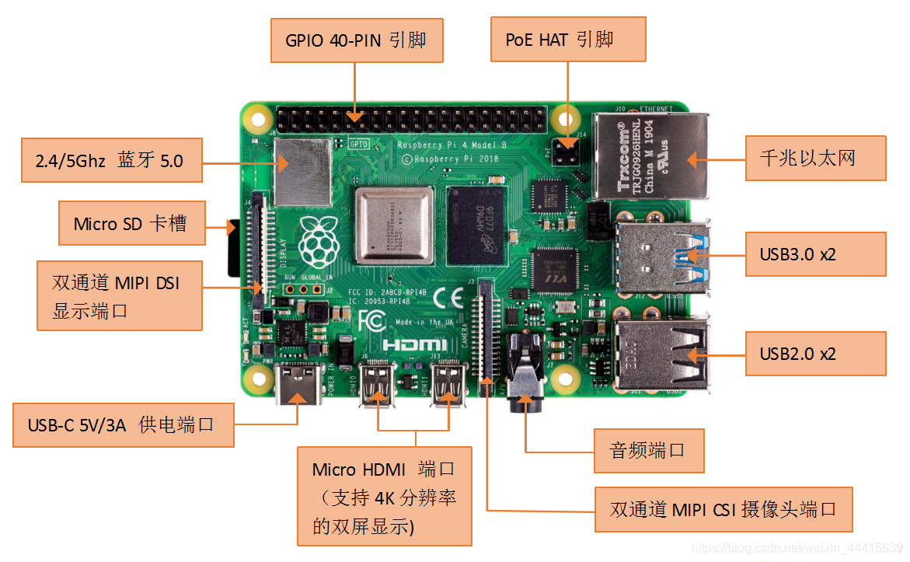

### 时间服务

```bash
sudo ntpq  -pn        #查询当前NTP时间服务器

#强制更新当前时间
sudo systemctl  stop ntp
sudo ntpd -gq
sudo systemctl  start ntp

#手动修改当前时区, 覆盖式更新
sudo cp  /usr/share/zoneinfo/Asia/Shanghai   /etc/localtime 
```

## GPIO 硬件编程

**树莓派3B+的GPIO 接口由 40 个针脚 (PIN) 组成.**

- 针脚定义
  - 固定输出 5V ( 2, 4 号PIN)
  - 固定输出 3.3V (1,17 号PIN)
  - 地线Ground (  6, 9, 14, 20, 25, 30, 34, 39 号PIN)
  - 27号ID_SD 和 28号ID_SC 是两个特殊的PIN 
    - 用于和附加的电路板通信.
- PIN大多数编成 GPIOX 的编号
  - 例如: GPIO14 , 操作系统会用 GPIO14来代指 PIN8 这个位置
    - 也就是说, 每个大部分PIN 会对应一个系统中的某个 GPIOX. 编号
- 每个 GPIO 的 PIN 都能处于输入输出状态
  - 当处于输出状态时
    - 系统可以把 1或0 传给该PIN , 如果1,那么对应的物理PIN向外输出3.3V的高电压.否则输出0V低电压
  - 当处于输入状态时
    - PIN会探测物理 PIN 上的电压,如果是高电压,那么该PIN会向系统返回1, 否则返回0


**串联任何PIN针脚到 GUN也就是地线Ground的时候, 必须在地线端添加一个电阻(330欧姆,带色环的连接到接地,无色环的连接到3.3V输出),电压是3.3V,通过电阻之后的电流0.015A安(必须降低到这个系数).**

**`E=I ·R     电压V=电流I x 比例系数R(也就是欧姆值)`**

**为了防止短路,那么必须控制回到地线的电流不可以高于0.015A .**




# 开启SerialPort端口

```bash
sudo raspi-config 

#选择第三个 
3 Interface Options    Configure connections to peripherals              
# 再选择 第六个
I6 Serial Port Enable/disable shell messages on the serial connection 
# 第一个窗口， 选择 no  否
Would you like a login shell to be accessible over 
serial?                
# 第二个窗口， 选择 yes 是
Would you like the serial port hardware to be enabled? 

# 完成后，重启， 要保证 /dev/ttyS0  有这个设备。
```


# 安装WiringPi驱动

```bash
# 项目地址 https://github.com/WiringPi/WiringPi
# 源码安装：
sudo apt install git -y
git clone https://github.com/WiringPi/WiringPi.git
cd WiringPi
# build the package
./build debian
mv debian-template/wiringpi_3.10_arm64.deb .
# install it
sudo apt install ./wiringpi_3.10_arm64.deb

# 安装完后， 重新登录下
```

```bash
pi@raspberrypi:~ $ gpio readall
 +-----+-----+---------+------+---+---Pi 4B--+---+------+---------+-----+-----+
 | BCM | wPi |   Name  | Mode | V | Physical | V | Mode | Name    | wPi | BCM |
 +-----+-----+---------+------+---+----++----+---+------+---------+-----+-----+
 |     |     |    3.3v |      |   |  1 || 2  |   |      | 5v      |     |     |
 |   2 |   8 |   SDA.1 |   IN | 1 |  3 || 4  |   |      | 5v      |     |     |
 |   3 |   9 |   SCL.1 |   IN | 1 |  5 || 6  |   |      | 0v      |     |     |
 |   4 |   7 | GPIO. 7 |   IN | 1 |  7 || 8  | 1 | IN   | TxD     | 15  | 14  |
 |     |     |      0v |      |   |  9 || 10 | 1 | IN   | RxD     | 16  | 15  |
 |  17 |   0 | GPIO. 0 |   IN | 0 | 11 || 12 | 0 | IN   | GPIO. 1 | 1   | 18  |
 |  27 |   2 | GPIO. 2 |   IN | 0 | 13 || 14 |   |      | 0v      |     |     |
 |  22 |   3 | GPIO. 3 |   IN | 0 | 15 || 16 | 0 | IN   | GPIO. 4 | 4   | 23  |
 |     |     |    3.3v |      |   | 17 || 18 | 0 | IN   | GPIO. 5 | 5   | 24  |
 |  10 |  12 |    MOSI |  OUT | 0 | 19 || 20 |   |      | 0v      |     |     |
 |   9 |  13 |    MISO | ALT0 | 0 | 21 || 22 | 0 | IN   | GPIO. 6 | 6   | 25  |
 |  11 |  14 |    SCLK | ALT0 | 0 | 23 || 24 | 1 | OUT  | CE0     | 10  | 8   |
 |     |     |      0v |      |   | 25 || 26 | 1 | OUT  | CE1     | 11  | 7   |
 |   0 |  30 |   SDA.0 |   IN | 1 | 27 || 28 | 1 | IN   | SCL.0   | 31  | 1   |
 |   5 |  21 | GPIO.21 |   IN | 1 | 29 || 30 |   |      | 0v      |     |     |
 |   6 |  22 | GPIO.22 |   IN | 1 | 31 || 32 | 0 | OUT  | GPIO.26 | 26  | 12  |
 |  13 |  23 | GPIO.23 |   IN | 0 | 33 || 34 |   |      | 0v      |     |     |
 |  19 |  24 | GPIO.24 |   IN | 0 | 35 || 36 | 0 | IN   | GPIO.27 | 27  | 16  |
 |  26 |  25 | GPIO.25 |   IN | 0 | 37 || 38 | 0 | IN   | GPIO.28 | 28  | 20  |
 |     |     |      0v |      |   | 39 || 40 | 0 | IN   | GPIO.29 | 29  | 21  |
 +-----+-----+---------+------+---+----++----+---+------+---------+-----+-----+
 | BCM | wPi |   Name  | Mode | V | Physical | V | Mode | Name    | wPi | BCM |
 +-----+-----+---------+------+---+---Pi 4B--+---+------+---------+-----+-----+
```


## WiringPi编程

```bash
# 编译命令
gcc -o myapp myapp.c -l wiringPi

cd examples
make <example-name | really-all>
```


```c
#include <wiringPi.h> // Include WiringPi library!

int main(void)
{
  // uses BCM numbering of the GPIOs and directly accesses the GPIO registers.
  // 使用 GPIO 的 BCM 编号并直接访问 GPIO 寄存器。
  wiringPiSetupGpio();

  // pin mode ..(INPUT, OUTPUT, PWM_OUTPUT, GPIO_CLOCK)
  // 引脚模式..（输入、输出、PWM_OUTPUT、GPIO_CLOCK）
  // set pin 17 to input
  // 将引脚 17 设置为输入
  pinMode(17, INPUT);

  // pull up/down mode (PUD_OFF, PUD_UP, PUD_DOWN) => down
  // 上拉/下拉模式 (PUD_OFF, PUD_UP, PUD_DOWN) => 下拉
  pullUpDnControl(17, PUD_DOWN);

  // get state of pin 17 获取引脚 17 的状态
  int value = digitalRead(17);

  if (HIGH == value)
  {
    // your code
  }
}
```


## 串口通信

连接 GND ,  交叉连接 RXD, TXD 这三根线即可。

编译完成后，使用root运行

```c++
// 发送数据
#include <iostream>
#include<wiringPi.h>
#include<wiringSerial.h>

using namespace std;
int main(int argc, char* argv[]){
	
	int MySerial;

        if (wiringPiSetup()<0)
        {
                cout << "Setup Failed!\n";
                exit(0);
        }

        if ((MySerial=serialOpen("/dev/ttyS0", 115200))<0)
        {
                cout << "Serial Failed!\n";
                exit(0);
        }

        while (1)
        {
                serialPrintf(MySerial,"Hello World!\n");
                delay(100);
        }

        serialClose(MySerial);

        return 0;
}
```

```c++
// 接收数据
#include<iostream>
#include<wiringPi.h>
#include<wiringSerial.h>

#define LED 1

using namespace std;

int main()
{
        int MySerial;
        if (wiringPiSetup()<0)
        {
                cout << "Setup Failed!\n";
                exit(0);
        }
        pinMode(LED, OUTPUT);

        if ((MySerial=serialOpen("/dev/ttyS0", 115200))<0)
        {
                cout << "Serial Failed!\n";
                exit(0);
        }

        while (1)
        {
                if (serialDataAvail(MySerial)>0)
                {
                        char ch=serialGetchar(MySerial);
                        cout << ch << endl;
                        int val=ch-48;
                        digitalWrite(LED, val);
                }
        }

        serialClose(MySerial);

           return 0;
}
```
